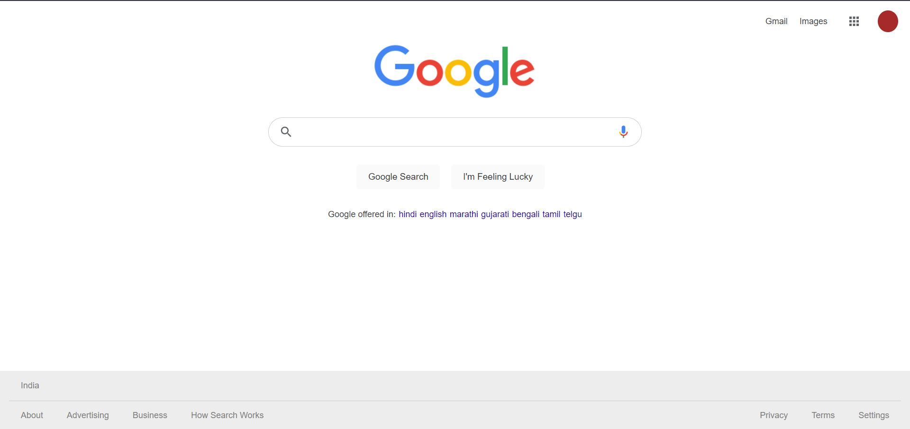
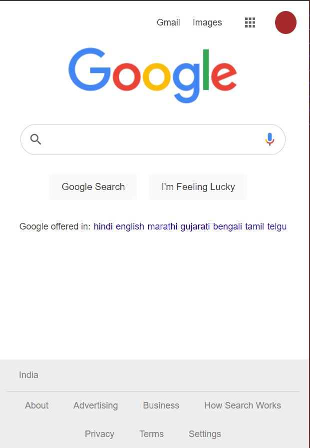

# The Odin Project - Foundations Google Homepage

This is a solution to the [Google Homepage Assignment](https://www.theodinproject.com/paths/foundations/courses/foundations/lessons/html-css).

## Table of contents

- [Overview](#overview)
  - [The challenge](#the-challenge)
  - [Screenshot](#screenshot)
  - [Links](#links)
- [My process](#my-process)
  - [Built with](#built-with)
- [Author](#author)

## Overview

### The challenge

Users should be able to:

- View the optimal layout depending on their device's screen size

### Screenshot

### Links

- Live Site URL: [Site](https://foolhardy21.github.io/google-homepage/)

## My process

### Built with

- Semantic HTML5 markup
- Flexbox
- Media Query
- SVGs

### What I learned

I learnt the how a responsive site works by varying the viewport size. Along with this I learnt using SVGs as an asset. Apart from this, I learnt the basics of Flex-Box.

## Author

- Frontend Mentor - [@foolhardy21](https://www.frontendmentor.io/profile/foolhardy21)
